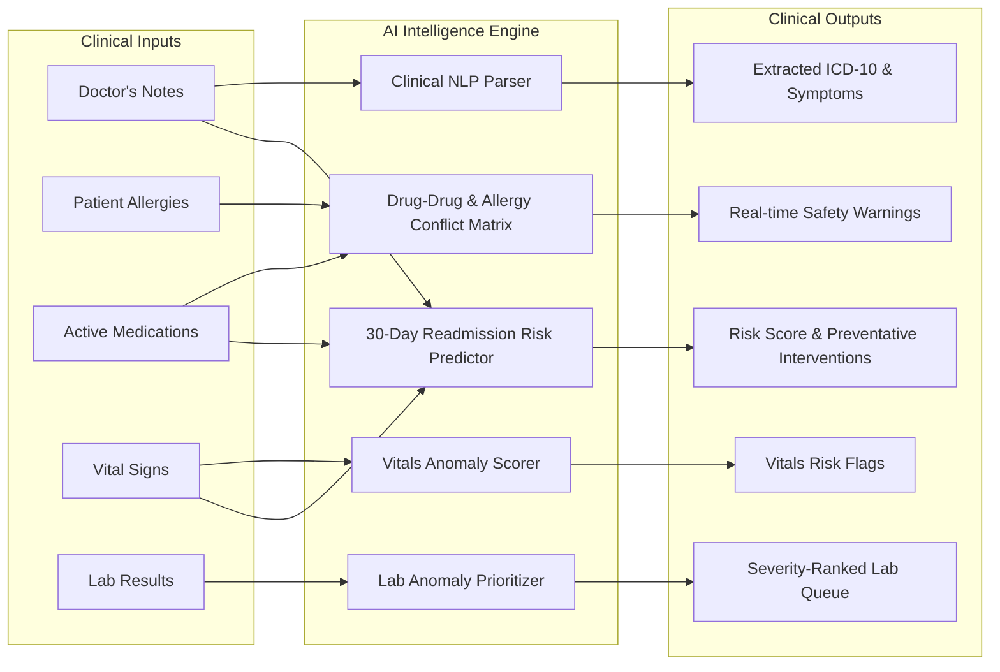
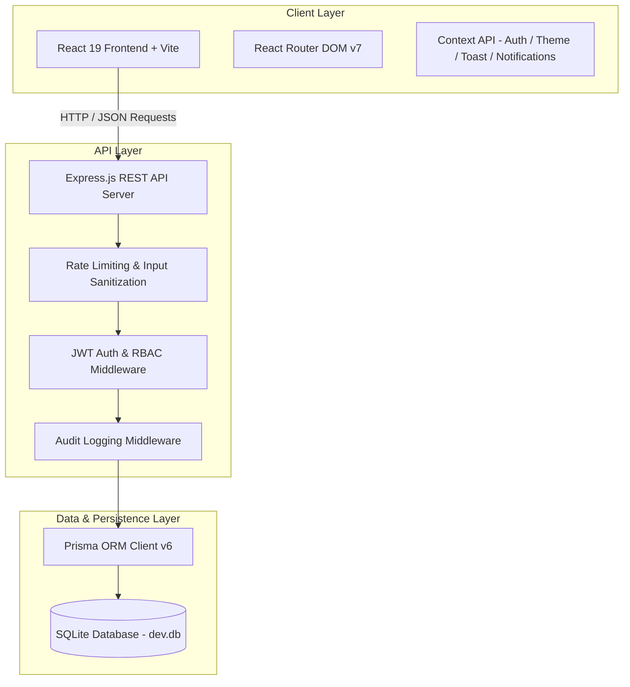

<div align="center">

# 🏥 HospitalRun

**Next-Generation Open Source Hospital Information & Healthcare Management System (HIS/EHR)**

[](https://react.dev/)
[](https://vite.dev/)
[](https://nodejs.org/)
[](https://expressjs.com/)
[](https://www.prisma.io/)
[](https://www.sqlite.org/)
[](https://opensource.org/licenses/MIT)

<p align="center">
  A modern, responsive, and AI-assisted hospital management platform engineered for clinicians, administrators, pharmacists, and lab technicians. Built with offline-first and low-resource environment resilience in mind.
</p>

</div>

---

## 📖 Table of Contents

- [Overview](#-overview)
- [Key Features](#-key-features)
- [AI Clinical Intelligence Suite](#-ai-clinical-intelligence-suite)
- [System Architecture](#-system-architecture)
- [Project Directory Structure](#-project-directory-structure)
- [Getting Started & Quick Setup](#-getting-started--quick-setup)
- [Default Login Credentials](#-default-login-credentials)
- [Role-Based Access Control (RBAC)](#-role-based-access-control-rbac)
- [API Reference](#-api-reference)
- [Available Scripts](#-available-scripts)
- [Contributing](#-contributing)
- [License](#-license)

---

## 🌟 Overview

**HospitalRun** is an intuitive, fast, and feature-rich Hospital Information System (HIS) designed to streamline clinical workflows and eliminate administrative overhead. 

From patient registration and appointment scheduling to electronic prescriptions, inventory control, automated billing, and real-time clinical decision support, HospitalRun equips healthcare providers with an all-in-one digital operating system.

---

## ✨ Key Features

### 👥 1. Comprehensive Patient & Vitals Records
- **Electronic Health Records (EHR)**: Manage patient demographics, contact details, blood groups, known allergies, and medical history.
- **Vitals Monitoring**: Record and track historical vitals—Body Temperature, Blood Pressure, Pulse Rate, Respiratory Rate, Oxygen Saturation ($SpO_2$), and Weight.
- **Patient Detail Dashboard**: Integrated chronological views of appointments, diagnoses, lab investigations, prescribed medicines, and invoices.

### 📅 2. Smart Scheduling & Appointments
- **Lifecycle Management**: Track visits through `SCHEDULED` ➡️ `IN_PROGRESS` ➡️ `COMPLETED` / `CANCELLED`.
- **Intelligent Rescheduling**: Update date, time, and assigned physician while appending audit remarks and resetting status.
- **Quick Next Follow-Up**: Instantly schedule follow-up visits pre-filled with the current doctor and patient record.
- **Unified Multi-Field Search**: Search appointments in real-time by patient name, patient ID, doctor name, or appointment code.

### 👨‍⚕️ 3. Doctor & Clinical Management
- Maintain physician profiles, department specializations, qualifications, contact details, consultation fees, and operational availability (`ACTIVE` / `ON_LEAVE` / `INACTIVE`).

### 🧪 4. Laboratory Diagnostics
- Monitor diagnostic tests across their lifecycle (`PENDING` ➡️ `IN_PROGRESS` ➡️ `COMPLETED`).
- Detailed diagnostic test descriptions, attached physician orders, and structured test results entry.

### 💊 5. Pharmacy & Inventory Control
- Full medicine catalog tracking stock levels, unit pricing, batch numbers, manufacturer info, and expiration dates.
- **Automated Low-Stock Alerts**: Real-time warnings when inventory levels fall below threshold.

### 🧾 6. Billing, Invoices & Payments
- Itemized invoice generator supporting consultations, diagnostic tests, medications, and surgical procedures.
- Flexible payment methods (`CASH`, `CARD`, `UPI`, `INSURANCE`) with payment status tracking (`PENDING`, `PARTIAL`, `PAID`, `CANCELLED`).

### 🛡️ 7. Security & Immutable Audit Logging
- Full compliance and security audit trail capturing every write, update, deletion, and auth action with user metadata, timestamp, target entity, and client IP.

### 🌓 8. Modern UI & Theme Customization
- Responsive design tailored for desktops, tablets, and mobile devices.
- Built-in Light and Dark themes with customizable UI density and system settings.

---

## 🧠 AI Clinical Intelligence Suite

HospitalRun integrates an intelligent clinical decision support system directly into provider workflows:



1. **Drug-Drug & Allergy Conflict Engine**: Real-time validation preventing contraindicated drug combinations (e.g., Aspirin + Clopidogrel) and alerting if prescribed drugs conflict with patient allergies (e.g., Penicillin, Sulfa).
2. **Predictive 30-Day Readmission Risk**: Machine-assisted risk calculation based on patient age, visit frequency, polypharmacy, chronic comorbidities, and vital parameters.
3. **Lab Anomaly Detection**: Automatic flagging of abnormal values in CBC, Metabolic Panel, Lipid Panel, Thyroid, LFT, and RFT with high-priority queue sorting.
4. **Clinical Notes NLP Parser**: Natural language extraction of symptoms, suspected conditions, ICD-10 codes, and medications from unstructured clinical notes.
5. **AI Pre-Visit Assistant**: Attendance and no-show prediction with checklist suggestions prior to patient consultations.

---

## 🏗️ System Architecture



### Stack Breakdown

| Layer | Technologies |
| :--- | :--- |
| **Frontend** | React 19, Vite 8, React Router v7, Lucide Icons, Custom CSS Design Tokens |
| **Backend API** | Node.js, Express.js, JWT, bcryptjs, express-validator, express-rate-limit, cors |
| **Database & ORM** | SQLite, Prisma ORM v6 |
| **Monorepo Orchestration** | Concurrently |

---

## 📁 Project Directory Structure

```
hospitalrun-master/
├── package.json                 # Monorepo configuration & unified scripts
├── server/                      # Express REST API Backend
│   ├── prisma/
│   │   ├── schema.prisma        # Prisma data models & SQLite configuration
│   │   ├── dev.db               # SQLite database file
│   │   └── seed.js              # Database seed data (users, doctors, patients, meds)
│   ├── src/
│   │   ├── index.js             # Express entry point & middleware registration
│   │   ├── middleware/          # JWT auth, RBAC & audit logging middleware
│   │   └── routes/              # REST controllers for all hospital modules
│   └── package.json             # Backend dependencies & scripts
├── frontend/                    # React Vite Frontend Client
│   ├── index.html               # Main HTML shell
│   ├── src/
│   │   ├── App.jsx              # App root, routing & provider trees
│   │   ├── App.css              # Design system tokens, styles, and themes
│   │   ├── components/          # Reusable UI widgets, layout navbar, sidebar
│   │   ├── context/             # Auth, Theme, Toast, and Notification state
│   │   ├── pages/               # Views: Dashboard, Patients, Appointments, AI Suite, etc.
│   │   ├── services/            # API client wrapper (`api.js`)
│   │   └── utils/               # Date & formatting helpers (`format.js`)
│   └── package.json             # Frontend dependencies & scripts
├── SYSTEM_DOCUMENTATION.md      # In-depth system specifications & documentation
└── WALKTHROUGH.md               # Technical developer manual & request lifecycle
```

---

## 🚀 Getting Started & Quick Setup

### Prerequisites
- [Node.js](https://nodejs.org/) `>= 18.0.0`
- `npm` `>= 9.0.0`

### 1. Clone the Repository
```bash
git clone https://github.com/HospitalRun/hospitalrun.git
cd hospitalrun
```

### 2. Install All Dependencies
Install dependencies across both root, `server`, and `frontend` packages with a single command:
```bash
npm run install:all
```

### 3. Initialize & Seed Database
Apply Prisma migrations to create the SQLite schema, then populate initial seed records (admin user, doctors, sample patients, pharmacy inventory, and appointments):
```bash
npm run db:migrate
npm run db:seed
```

### 4. Launch Development Environment
Start both the Express API server and Vite frontend dev server concurrently:
```bash
npm run dev
```

### Application URLs & Ports
- 🖥️ **Frontend Application**: [http://localhost:5173](http://localhost:5173)
- ⚙️ **Backend REST API**: [http://localhost:5000](http://localhost:5000)
- 🗄️ **Prisma Studio (DB Admin GUI)**: `npm run db:studio` ➡️ [http://localhost:5555](http://localhost:5555)

---

## 🔐 Default Login Credentials

Once seeded, you can sign in using the default administrative credentials:

| Role | Email | Password |
| :--- | :--- | :--- |
| **System Administrator** | `admin@hospitalrun.io` | `admin123` |

---

## 🛡️ Role-Based Access Control (RBAC)

HospitalRun enforces role-based endpoint authorization across 6 distinct hospital roles:

| Module / Action | `ADMIN` | `DOCTOR` | `NURSE` | `RECEPTIONIST` | `PHARMACIST` | `LAB_TECH` |
| :--- | :---: | :---: | :---: | :---: | :---: | :---: |
| **Dashboard Analytics** | ✅ | ✅ | ✅ | ✅ | ✅ | ✅ |
| **Patient Directory (View/Search)** | ✅ | ✅ | ✅ | ✅ | ✅ | ✅ |
| **Patient Intake & Registration** | ✅ | ❌ | ❌ | ✅ | ❌ | ❌ |
| **Vitals Recording** | ✅ | ✅ | ✅ | ❌ | ❌ | ❌ |
| **Clinical Diagnosis & Notes** | ✅ | ✅ | ❌ | ❌ | ❌ | ❌ |
| **AI Clinical Decision Support** | ✅ | ✅ | ❌ | ❌ | ❌ | ❌ |
| **Appointment Scheduling** | ✅ | ✅ | ✅ | ✅ | ❌ | ❌ |
| **Pharmacy & Medicine Stock** | ✅ | ❌ | ❌ | ❌ | ✅ | ❌ |
| **Prescription Dispensing** | ✅ | ❌ | ❌ | ❌ | ✅ | ❌ |
| **Laboratory Test Results Entry** | ✅ | ❌ | ❌ | ❌ | ❌ | ✅ |
| **Billing, Invoicing & Payments** | ✅ | ❌ | ❌ | ✅ | ❌ | ❌ |
| **Security Audit Logs** | ✅ | ❌ | ❌ | ❌ | ❌ | ❌ |
| **System Settings** | ✅ | ❌ | ❌ | ❌ | ❌ | ❌ |

---

## 🔌 API Reference

The backend exposes a structured RESTful API under `/api`:

| Category | Endpoint | Methods | Description |
| :--- | :--- | :--- | :--- |
| **Auth** | `/api/auth/login` | `POST` | Authenticate user & issue JWT |
| | `/api/auth/me` | `GET` | Retrieve authenticated user profile |
| **Patients** | `/api/patients` | `GET`, `POST` | List/search patients or create a new patient |
| | `/api/patients/:id` | `GET`, `PUT`, `DELETE` | Retrieve, update or delete patient record |
| | `/api/patients/:id/vitals` | `POST` | Record patient vital signs |
| **Appointments** | `/api/appointments` | `GET`, `POST` | List appointments or schedule a new visit |
| | `/api/appointments/:id` | `GET`, `PUT`, `DELETE` | View details, reschedule/update, or delete |
| **Doctors** | `/api/doctors` | `GET`, `POST` | Doctor directory and profile management |
| **Medicines** | `/api/medicines` | `GET`, `POST`, `PUT` | Inventory catalog, pricing, and stock updates |
| **Lab Reports** | `/api/lab-reports` | `GET`, `POST`, `PUT` | Order diagnostics and record completed results |
| **Billing** | `/api/billing` | `GET`, `POST`, `PUT` | Manage patient invoices, charges, and payments |
| **Clinical AI** | `/api/clinical-intelligence/drug-check` | `POST` | Evaluate drug interactions & allergy conflicts |
| | `/api/clinical-intelligence/readmission-risk` | `POST` | Calculate 30-day readmission risk score |
| | `/api/clinical-intelligence/parse-notes` | `POST` | NLP parsing of clinical notes (ICD-10/symptoms) |
| | `/api/clinical-intelligence/lab-anomalies` | `GET` | Severity-ranked lab queue anomaly scan |
| **Audit Logs** | `/api/audit-logs` | `GET` | View administrative security audit trail |
| **Notifications** | `/api/notifications` | `GET`, `PUT` | Real-time system and clinical notifications |
| **Settings** | `/api/settings` | `GET`, `PUT` | Hospital profile, preferences, and configs |

---

## 📜 Available Scripts

Run these scripts from the repository root:

| Command | Action |
| :--- | :--- |
| `npm run dev` | Runs both backend server and frontend client concurrently with hot reloading |
| `npm run install:all` | Installs dependencies in root, `server/`, and `frontend/` directories |
| `npm run dev:server` | Starts the Express server independently (`node --watch`) |
| `npm run dev:frontend` | Starts the Vite development server independently |
| `npm run db:migrate` | Runs Prisma schema migrations against the local SQLite database |
| `npm run db:seed` | Seeds the database with default admin user, doctors, patients, and meds |
| `npm run db:studio` | Launches Prisma Studio GUI to explore and edit database tables |

---

## 🤝 Contributing

Contributions are warmly welcomed! To contribute:

1. **Fork the Repository**
2. **Create a Feature Branch** (`git checkout -b feature/AmazingFeature`)
3. **Commit Your Changes** (`git commit -m 'feat: Add AmazingFeature'`)
4. **Push to the Branch** (`git push origin feature/AmazingFeature`)
5. **Open a Pull Request**

Please ensure your code follows clean architecture practices and does not introduce regression in existing modules.

---

## 📄 License

This project is licensed under the **MIT License** - see the [LICENSE](LICENSE) file for details.
