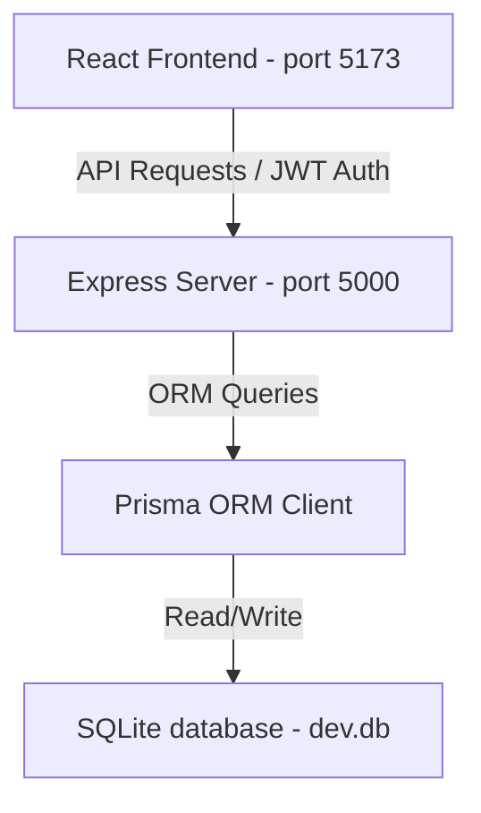

# HospitalRun - Product System Documentation & Developer Manual

This document provides comprehensive technical details for the HospitalRun application, including its architectural stack, configuration guidelines, core modules, search engines, standard date utility, and the newly implemented AI-Powered Clinical Intelligence features.

---

## 🛠️ 1. Architecture & Tech Stack

HospitalRun is coordinate-managed as a Javascript/Typescript monorepo with decoupled API (`server`) and UI (`frontend`) layers.



### **Frontend Client**
*   **Library & Framework**: **React 19** utilizing functional components, custom hooks, and React Router DOM v7.
*   **Dev Server & Bundler**: **Vite 8** for fast HMR compilation.
*   **Styling**: Vanilla CSS utilizing custom CSS design variables, light/dark themes, CSS grid layouts, and animations.
*   **Icons**: `lucide-react`.

### **Backend Server**
*   **Framework**: **Express.js** managing middleware pipelines and REST controller endpoints.
*   **Database ORM**: **Prisma ORM Client v6** providing strict schema type-safety.
*   **Database**: **SQLite** (file-based database: `server/prisma/dev.db`).

---

## ⚙️ 2. Quick Setup & Execution

From the root directory, run these scripts to initialize the environment:

1.  **Install Dependencies**: Install all monorepo modules:
    ```bash
    npm run install:all
    ```
2.  **Generate Database Schema**: Runs migrations to create SQLite tables:
    ```bash
    npm run db:migrate
    ```
3.  **Seed Dummy Data**: Populations database with admin login, dummy patients, doctors, and medicine records:
    ```bash
    npm run db:seed
    ```
4.  **Launch Dev Server**: Start both Vite and Express concurrently:
    ```bash
    npm run dev
    ```

---

## 🧬 3. Core Modules & Specifications

### **🔑 Authentication & Role-Based Access Control (RBAC)**
Secure JWT credentials are saved inside the browser's `localStorage`. User routes are protected using Express middleware:
*   `ADMIN`: Full access to settings and system audit logs.
*   `DOCTOR`: Authorize clinical diagnoses, prescriptions, and diagnostics.
*   `NURSE`: Log vitals and view scheduling.
*   `RECEPTIONIST`: Patient intake, schedules appointments, and handles invoices.
*   `PHARMACIST`: Pharmacy catalog control and dispensing.
*   `LAB_TECH`: Laboratory report updates.

### **📅 Appointments & Scheduling**
*   **State Machine**: Traces visits via `SCHEDULED` ➡️ `IN_PROGRESS` ➡️ `COMPLETED` / `CANCELLED` statuses.
*   **Reschedule Flow**: Allows altering date/time and the physician. Resets status back to `SCHEDULED` and appends rescheduling remarks.
*   **Next Follow-Up**: Quickly schedules the patient's next checkup. Pre-fills doctor details and links back to the original appointment, mapping to the **existing patient ID** to avoid duplicates.
*   **Appointment Deletion**: Allows admins and receptionists to remove appointment records permanently.

### **🔍 Patient & Appointment Unified Search**
*   **Full Name Splitting**: Search queries are trimmed and split (e.g. `"Meera Joshi"`). The search system matches first/last name combinations, case-insensitively.
*   **SQLite Compatibility**: Uses a flat Prisma relation structure (e.g., `patient: { firstName: { contains: search } }`) omitting the `mode: 'insensitive'` argument to prevent crashes on SQLite databases.
*   **Multi-Field Match**: Appointment search queries against patient names, patient IDs, doctor names, and appointment ID strings simultaneously.

---

## 🧠 4. AI-Powered Clinical Intelligence

The application includes an embedded Clinical Intelligence suite running locally on the Express server:

### **1. Clinical Decision Support**
*   **Drug Interaction engine**: Checks prescriptions in real-time against an embedded list of critical drug-drug interaction pairs (e.g. Aspirin + Clopidogrel, Metoprolol + Propranolol).
*   **Allergy Conflict mapper**: Cross-checks patient documented allergies (e.g., Penicillin, Sulfa) against the drug classes being prescribed.
*   **Vitals Analyzer**: Instantly scores vital signs (temperature, BP, pulse rate, SPO2) and flags abnormal parameters.

### **2. Predictive Readmission Risk**
*   Calculates a 30-day readmission risk percentage (0-100%) using clinical scoring factors (advanced age, frequency of 90-day visits, abnormal vitals, chronic comorbidities, and polypharmacy).
*   Displays risk metrics with an animated circular gauge, factor bars, and recommends preventative interventions.

### **3. Lab Anomaly Detection**
*   Auto-flags completed lab result fields against reference ranges (CBC, Metabolic Panel, Lipid Panel, Thyroid, LFTs, RFTs).
*   Presents a prioritized laboratory queue sorted by clinical severity (Critical, High, Moderate).

### **4. Clinical Notes NLP Parser**
*   Uses a regex-based NLP engine to extract symptoms, ICD-10 codes, medications, and medical conditions directly from doctor's free-text notes.

### **5. AI Clinical Assist (Appointment Panel)**
*   Calculates attendance compliance/no-show risk for scheduled appointments.
*   Provides pre-visit checkup plan checklists for doctors based on patient history.

---

## 🗓️ 5. Standardized Date Formatting

To enforce formatting consistency, all display dates are standardized via `frontend/src/utils/format.js`:

| Format | Target Use Case | Example | Utility Function |
| :--- | :--- | :--- | :--- |
| `dd/MM/yyyy` | Displaying date-only fields (DOB, Lab Date, Expiry) | `09/07/2026` | `formatDate(date)` |
| `dd/MM/yyyy hh:mm A` | Displaying datetime fields (Appointments, Audits, Logs) | `09/07/2026 12:30 PM` | `formatDateTime(date)` |

*Note: Frontend `<input type="date">` and `<input type="datetime-local">` form values continue using standard ISO strings (`yyyy-MM-dd` and `yyyy-MM-ddThh:mm`) for browser compatibility.*
