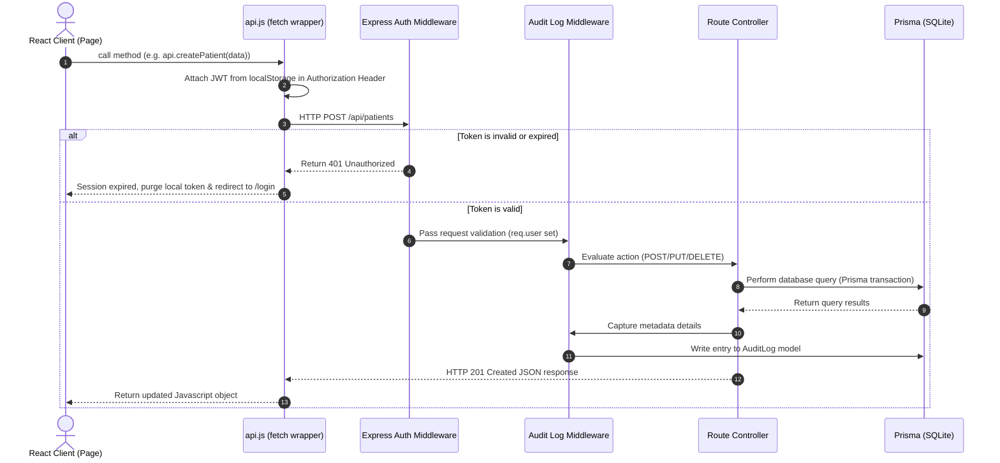

# HospitalRun - Monorepo Technical Walkthrough & Module Specification

Welcome to the **HospitalRun** technical walkthrough. This document outlines the application's tech stack, directory structure, module features, schema details, and authorization workflow.

---

## 🛠️ 1. Technical Stack

The application is structured as a Javascript/Typescript monorepo with separate client (`frontend`) and API (`server`) layers.

### **Frontend (Client)**
*   **Core Library**: [React 19](https://react.dev/) (built using functional components and hooks)
*   **Routing**: [React Router DOM (v7)](https://reactrouter.com/) for client-side routing, protected routes, and authentication guards.
*   **Build Tool & Dev Server**: [Vite (v8)](https://vite.dev/) for fast hot module replacement (HMR) and production bundling.
*   **Styling**: Custom CSS and design tokens (`App.css`, `style.css`) providing responsive flexbox/grid layouts, light/dark themes, and interactive dashboard UI.
*   **Icons**: [Lucide React](https://lucide.dev/) for dashboard icons.
*   **State & Utilities**: Context API providers (`AuthContext`, `ThemeContext`, `ToastContext`, `NotificationContext`) for clean, decentralized state management.

### **Backend (Server)**
*   **Runtime Environment**: [Node.js](https://nodejs.org/) (running with `--watch` mode in development).
*   **Web Framework**: [Express.js](https://expressjs.com/) for routing, middleware pipeline, and REST API controller registration.
*   **Database ORM**: [Prisma Client v6](https://www.prisma.io/) as the Object-Relational Mapper, executing queries with full type safety.
*   **Database**: [SQLite](https://www.sqlite.org/) (file-based relational database configured via `prisma/schema.prisma` and `.env`).
*   **Security & Encryption**:
    *   `jsonwebtoken` (JWT) for secure authentication.
    *   `bcryptjs` for high-entropy password hashing.
    *   `express-rate-limit` for DDoS prevention and API throttling.
    *   `express-validator` for API input sanitization and verification.
*   **Cross-Origin Requests**: `cors` middleware enabling secure cross-origin resource sharing between backend and frontend.

### **Monorepo / Coordination**
*   **Concurrently**: Orchestrates running the Express server (`node --watch`) and Vite dev server (`vite`) simultaneously via `npm run dev` from the root workspace.

---

## 🗂️ 2. Project Architecture & Directory Map

```
hospitalrun-master/
├── package.json               # Root monorepo workspace configurations & script runners
├── server/                    # Express.js REST API Server
│   ├── prisma/
│   │   ├── schema.prisma      # Prisma SQLite model schema declarations
│   │   ├── dev.db             # File-backed SQLite DB (generated locally)
│   │   └── seed.js            # Initial dummy users, doctors, and medicines seed data
│   ├── src/
│   │   ├── index.js           # Express main server entry point & middleware router bindings
│   │   ├── middleware/        # JWT validator & audit logger middleware
│   │   └── routes/            # Route controllers mapping HTTP endpoints to database actions
└── frontend/                  # React Vite client
    ├── index.html             # Main index shell
    ├── package.json           # Frontend packages & build script configurations
    ├── src/
    │   ├── main.jsx           # React app renderer
    │   ├── App.jsx            # Routing and provider wrapping hierarchy
    │   ├── App.css            # Component-level styles
    │   ├── components/        # Layout shells and UI error boundaries
    │   ├── context/           # Auth, notifications, styling theme, and notification context
    │   ├── pages/             # Page components matching React Router routes
    │   └── services/
    │       └── api.js         # HTTP fetch wrapper client pointing to the backend REST API
```

---

## 💡 3. Core Modules & Feature Specifications

### **🔑 Authentication & Role-Based Access Control (RBAC)**
*   **Session Management**: Secure JSON Web Tokens (JWT) are issued at login and stored locally by the client. The system intercepts responses and redirects to `/login` if session validation expires (status `401`).
*   **User Roles Supported**:
    *   `ADMIN` (Full system configuration, settings, audit logs)
    *   `DOCTOR` (Write prescriptions, view clinical diagnostics, manage patient list)
    *   `NURSE` (Add/view vitals, patient lookup, check schedule)
    *   `RECEPTIONIST` (Patient registration, appointment scheduling, billing invoices)
    *   `PHARMACIST` (Manage medicine catalog, view prescriptions, dispense medicines)
    *   `LAB_TECH` (Record test results, update laboratory report statuses)
*   **Security Restrictions**: Specific routes utilize `authorize(...roles)` middleware to restrict endpoints to matching roles (e.g., only `ADMIN` or `PHARMACIST` can modify inventory).

### **📊 Dashboard**
*   **Aggregated Analytics**: Loads real-time metric indicators (Total Patients, Active Doctors, Scheduled Appointments Today, Low Stock Medicines, Pending Lab Reports, Outstanding Billings, and Net Total Revenue).
*   **Timeline Feeds**: Displays recent patients and upcoming appointments.

### **👤 Patient & Vitals Management**
*   **Demographic Profile**: Track key fields (Patient ID, name, date of birth, gender, contact details, allergies, and historical conditions).
*   **Vitals Tracking**: Detailed log of measurements (temperature, blood pressure, pulse rate, oxygen saturation ($SpO_2$), weight, recorder name, and timestamp).

### **📅 Appointment Scheduling**
*   **Status Workflow**: Traces appointments through `SCHEDULED`, `IN_PROGRESS`, `COMPLETED`, and `CANCELLED`.
*   **Type categorization**: `CHECKUP`, `FOLLOW_UP`, `EMERGENCY`, or `CONSULTATION`.
*   **Doctor Assignment**: Link patients to specific doctor clinics.

### **🧪 Laboratory Diagnostic Reports**
*   **Workflow**: Monitors lab tests from creation (`PENDING`) through execution (`IN_PROGRESS`) to results entry (`COMPLETED`).
*   **Association**: Maps specific tests to a patient and ordering doctor, with optional descriptions and diagnostic result texts.

### **💊 Pharmacy & Inventory Control**
*   **Medicine Records**: Comprehensive ledger of medications including price, stock, expiry date, category, and manufacturer.
*   **Low Stock Alerting**: Dynamic alarms if any medicine stock quantity drops to or below $10$.

### **🧾 Billing, Invoices & Payments**
*   **Structured Bills**: Tracks total bill amounts, amount paid, status (`PENDING`, `PARTIAL`, `PAID`, `CANCELLED`), and payment method (`CASH`, `CARD`, `UPI`, `INSURANCE`).
*   **Itemized Invoice**: Group line items by categories (`CONSULTATION`, `LAB_TEST`, `MEDICINE`, `PROCEDURE`, `OTHER`) with customized costs and quantity multipliers.

### **🚨 System Notifications**
*   **Trigger events**: Automatically issues notifications for low inventory stock, upcoming appointments, and ready test results.

### **📝 Security Audit Logging**
*   **Audit Trail**: Every mutating write (`POST`, `PUT`, `DELETE`), login, or privilege change is automatically recorded in the database.
*   **Recorded Data**: Capture executing user, target resource type, resource ID, action description, IP address, and operation timestamp.

---

## 🔄 4. Client-Server Request Lifecycle



---

## ⚙️ 5. Setting up and running locally

1.  **Dependency Installation**: Run `npm run install:all` in the root folder to download required modules for both client and backend layers.
2.  **Database Migration**: Run `npm run db:migrate` to build/sync the SQLite relational database based on the Prisma schema.
3.  **Database Seeding**: Run `npm run db:seed` to populate users, doctors, and medicines.
4.  **Local Execution**: Run `npm run dev` to start Vite (port `5173`) and Express (port `5000`) concurrently.
5.  **View Data**: Run `npm run db:studio` to open the local DB admin dashboard at [http://localhost:5555](http://localhost:5555).
